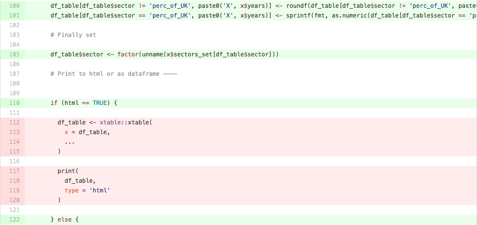

# Code coverage {#code_cover}

An additional set of tools we can start to use once we begin writing our own tests is code coverage tools, for instance [codecov.io](https://codecov.io/), or [coveralls.io](https://coveralls.io/). These tools are able to analyse the code we have written via hosting services like GitHub, and provide a line by line breakdown of which lines are tested, and which are not. For example, in the lines below from the file [year_sector_table.R](https://github.com/ukgovdatascience/eesectors/blob/master/R/year_sector_table.R), we can see that lines 112-115 and 117-120 are not explicitly tested. In this case, we probably don’t need to worry very much, but on other occasions this might prompt us to write more tests.

