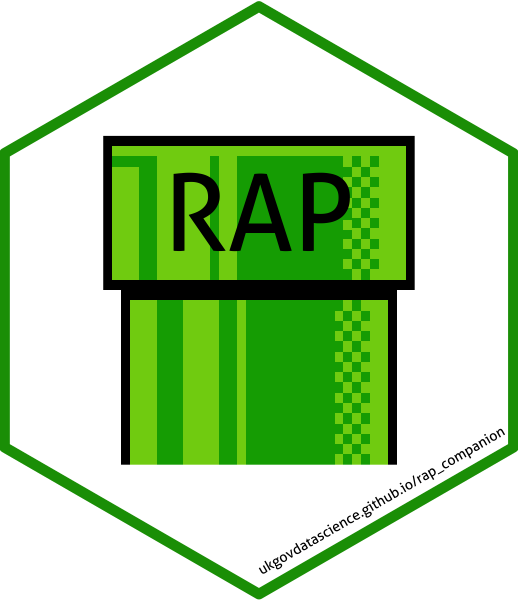

[Reproducible Analytical Pipeline Companion](https://ukgovdatascience.github.io/rap_companion/)   
==========================================

**This is a prototype and subject to constant development**

A technical communication document written using [bookdown](https://bookdown.org/) intended to give assistance to people developing a Reproducible Analytical Pipeline.  

This document is intended to be RAP community maintained. If you discover any good resources associated with RAP, please contribute to the development of this book by [forking and pulling](https://en.wikipedia.org/wiki/Fork_and_pull_model) on [Github](https://gist.github.com/Chaser324/ce0505fbed06b947d962).

See the
[eesectorsmarkdown](https://github.com/ukgovdatascience/eesectorsmarkdown)
repository for an example of implementing RAP as an R package in the context
of a Statistical First Release (SFR).  

## Learning to RAP

To complement this book, one of our RAP Champions has developed a [Massive Online Open Course](https://www.udemy.com/reproducible-analytical-pipelines/) to share an approach to learning this technical skill-set. This course is an informal introduction and describes the best practices through the use of screencasts and assignments. It is currently available on [Udemy](https://www.udemy.com/reproducible-analytical-pipelines/) and takes you through the RAP journey using a simple RAP example.  

## Collaboration

This is a community effort produced by those interested in automating the production of statistical reports in government. If you wish to contribute refer to the [CONTRIBUTING.md](https://github.com/ukgovdatascience/rap_companion/blob/master/CONTRIBUTING.md).  

## Issues

Every GitHub repo comes with a page for tracking issues. Use it! If you encounter a bug while reviewing the [RAP companion](https://ukgovdatascience.github.io/rap_companion/), jot a note down on the [issues page](https://github.com/ukgovdatascience/rap_companion/issues).

## Acknowledgements

Thanks to Dr Matthew Dray for converting the RAP logo into a hex sticker using the [hexSticker](https://cran.r-project.org/web/packages/hexSticker/index.html) pagkage. The warp pipe originates from [Wikimedia](https://commons.wikimedia.org/wiki/File:Warp_pipe_edited.PNG).  
RAP draws heavily on well-established software development best practices. We were introduced to these ideas through [software carpentry](https://software-carpentry.org/) and Hadley Wickham's [R packages book](http://r-pkgs.had.co.nz/).  
