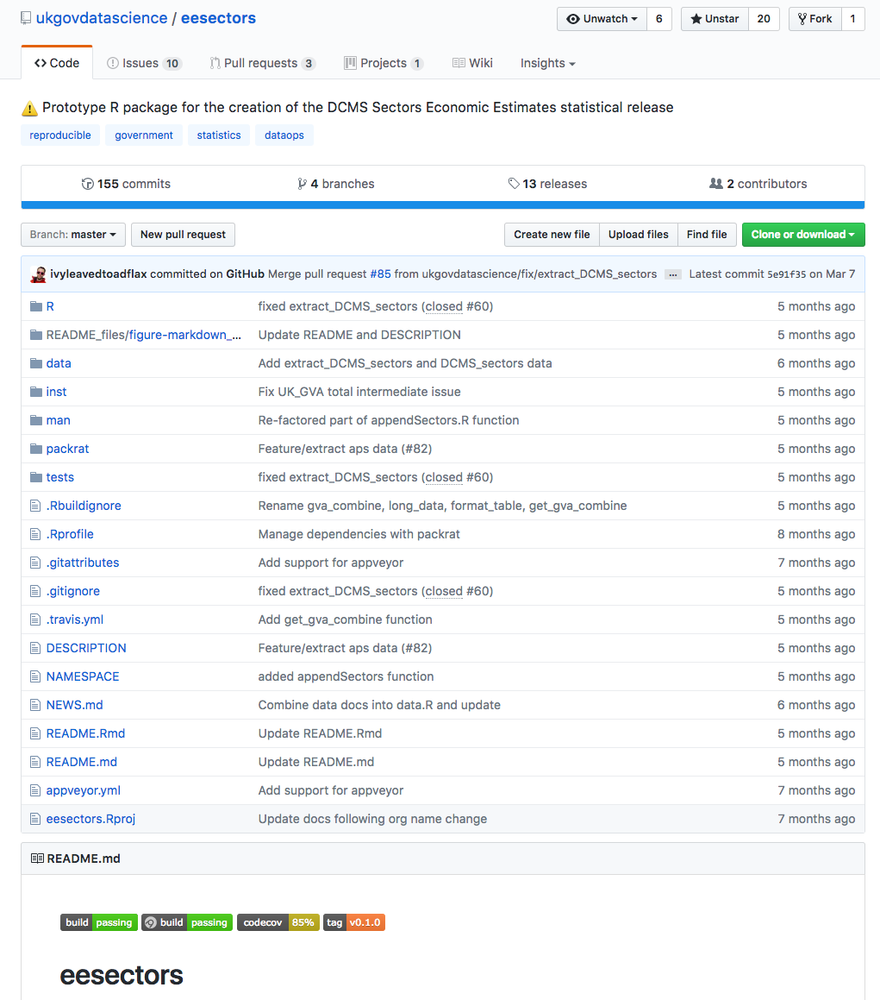
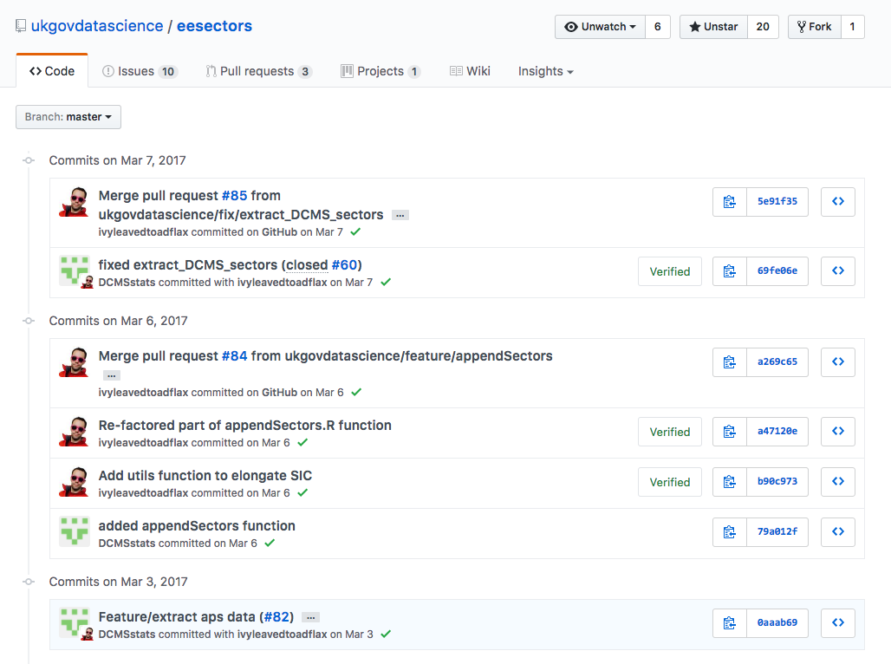

# Version Control {#vs}

## Introduction

Few software engineers would embark on a new project without using some sort of [version control software](https://en.wikipedia.org/wiki/Version_control). Version control software allows us to track the three Ws: **Who made Which change, and Why?**. Tools like [git](https://git-scm.com/) can be used to track files of any type, but are particularly useful for code in text files for example R or Python code.

Whilst git can be used locally on a single machine, or many networked machines, git can also be hooked up to free cloud services such as [GitHub](https://github.com/), [GitLab](https://about.gitlab.com/), or Bitbucket(https://bitbucket.org/). Each of these services provides hosting for your version control repository, and makes the code open and easy to share. The entire project we are working on with DCMS can be seen on [GitHub](https://github.com/ukgovdatascience/eesectors).

<a href="https://github.com/ukgovdatascience/eesectors" target="_blank"></a>

Obviously this won’t be appropriate for all Government projects (and solutions do exist to allow these services to be run within secure systems), but in our work with DCMS, we were able to publish all of our code openly. You can use [our code](https://github.com/ukgovdatascience/eesectors) to run an example based on the 2016 publication, but producing the entire publication from end to end would require access to data which is not published openly. Below is a screenshot from the commit history showing collaboration between data scientists in DCMS and GDS. The full page can be seen on [GitHub](https://github.com/ukgovdatascience/eesectors/commits/master).  

<a href="https://github.com/ukgovdatascience/eesectors/commits/master" target="_blank"></a>

Using a service like GitHub allows us to formalise the system of quality assurance (QA) in an auditable way. We can configure GitHub to require a code review by another person before the update to the code (this is called a [pull request](https://help.github.com/articles/about-pull-requests/)) is accepted into the main workstream of the project. You can see this in the screenshot below which relates to a pull request which fixed a [minor bug in the prototype](https://github.com/ukgovdatascience/eesectors/pull/71). The work to fix it was done by a data scientist at DCMS, and reviewed by a data scientist from GDS.

<a href="https://gdsdata.blog.gov.uk/2017/03/27/reproducible-analytical-pipeline/" target="_blank"></a>

The open nature of the good is great for transparency and facilitates review. The entire community can contribute to helping QA your code and identify [issues or bugs](https://github.com/ukgovdatascience/eesectors/issues). If you are lucky, they will not only report the bug / issue, but may also offer a fix for your code in the form of a pull request.  

## Useful resources

### Graphical user interface focus

A [useful book](http://happygitwithr.com/) on Git and Github that should cover all your needs for those who are uncomfortable working in a command line interface. This will cover most of your Git and Github workflow needs for collaborating in a team.  

### Command line focus

However, the terminal isn't that scary really and we recommend using it from the outset. Here's a [video tutorial](https://swcarpentry.github.io/git-novice/) that provides a good introduction and does not expect any experience of using the Unix shell (the terminal or command line).  

For a comprehensive tome try the [Pro Git book](https://git-scm.com/book/en/v2).

## Typical workflow

When you first start using git it can be difficult to remember all the commonly used commands.  

We give a simple workflow here (assuming you are collaborating on Github and have [set up a repo](https://help.github.com/articles/creating-a-new-repository/) called `my_repo` with the origin and remote set (try to avoid hyphens in names)). Remember to remove the comments when copying and pasting into the terminal. You will also need to give your new feature branch a good name.    

1. Open your terminal.
2. Navigate to `my_repo` using `cd`.
3. Check you are up-to-date:


```r
#  git checkout master
#  git pull
```

4. Create your new feature branch to work on and get to work:


```r
#  git checkout -b feature/post_name
```

5. [Squash your commits](https://stackoverflow.com/questions/5189560/squash-my-last-x-commits-together-using-git) if appropriate, then push your new branch to Github. You will want to squash all commits together associated with one discrete piece of work (e.g. coding one function).


```r
#  git push origin feature/post_name -u
```

6. On Github create a [pull request](https://help.github.com/articles/about-pull-requests/) and ask a colleague to review your changes before merging with the `master` branch (you can assign a reviewer in the PR page on Github).  

7. If accepted (and it passes all necessary checks) you're new feature will have been merged on Github. Fetch these changes locally.  


```r
#  git checkout master
#  git pull
```

8. You have a new master on Github. Pull it to your local machine and the development cycle starts again!  

CAVEAT: this workflow is not appropriate for large open collaborations, where fork and pull is preferred.  

